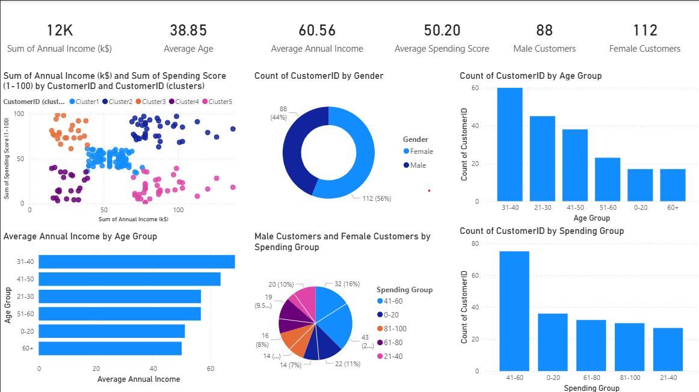

# 🛍️ Customer Segmentation Project

Segmenting mall customers based on demographics and spending behavior using **Python (scikit-learn)** and **Power BI**, to uncover actionable insights for targeted marketing.

---

## 📌 Overview

This project analyzes a dataset of 200 customers (Customer ID, Gender, Age, Annual Income, Spending Score) to identify distinct customer segments. K-means clustering groups customers by **Annual Income** and **Spending Score**, and the results are visualized in an interactive Power BI dashboard covering KPIs, cluster distribution, demographics, and spending behavior.

## ✨ Key Features

- 🔍 Clustering performed using **Python (scikit-learn)** / **Power BI**
- 📊 Analysis of purchase patterns and customer preferences
- 📈 Interactive Power BI dashboard visualizing segments and key characteristics
- 📄 Detailed report with insights and business recommendations for each segment

## 🧰 Tech Stack

| Category | Tools |
|---|---|
| Language | Python |
| ML Library | scikit-learn (K-Means Clustering) |
| Data Handling | pandas, NumPy |
| Visualization | Power BI, Matplotlib / Seaborn |

## 📊 Dashboard Highlights

| Metric | Value |
|---|---|
| Total Customers | 200 |
| Average Age | 38.85 years |
| Average Annual Income | 60.56 k$ |
| Average Spending Score | 50.20 / 100 |
| Male / Female Customers | 88 (44%) / 112 (56%) |

The dashboard includes:
- KPI summary cards
- Cluster scatter plot (Annual Income vs. Spending Score, 5 clusters)
- Gender distribution (donut chart)
- Customer count by Age Group and Spending Group
- Average Annual Income by Age Group
- Male vs. Female customers by Spending Group

## 🧩 Customer Segments Identified

| Cluster | Profile | Persona |
|---|---|---|
| Cluster 1 | Mid income, mid spending | Average / Standard Customers |
| Cluster 2 | High income, low-mid spending | High Earners, Cautious Spenders |
| Cluster 3 | Low income, high spending | Aspirational Spenders |
| Cluster 4 | Low income, low spending | Budget-Constrained Customers |
| Cluster 5 | High income, high spending | Premium / High-Value Customers |

## 💡 Key Insights

- The customer base is female-leaning (56% vs. 44%) and centered around working-age adults (21–50 years), who also earn the most on average.
- Most customers fall in the "average" 41–60 spending-score band — the biggest opportunity for growth.
- Income and spending behavior don't always align, showing that income-only targeting misses real behavioral differences.
- A small, high-income/high-spending segment (Cluster 5) represents the most valuable customers and should be prioritized for retention.

## 📝 Recommendations

- Build a VIP/loyalty tier for the high-income, high-spending segment.
- Use value-tier and bundled promotions for budget-constrained customers.
- Offer flexible payment options for low-income, high-spending customers to encourage sustainable spending.
- Focus core marketing spend on the 21–50 age range.
- Track cluster migration over time to measure campaign effectiveness.

> 📄 For the full analysis, see [`Customer_Segmentation_Report.docx`](./Customer_Segmentation_Report.docx).

## 🎯 Expected Outcome

Hands-on experience in customer analytics, segmentation, and translating dashboard insights into targeted business recommendations.

## 👤 Author

**Sumit Pawar**
B.Tech, Artificial Intelligence & Data Science

---
⭐ If you found this project useful, consider giving it a star!
